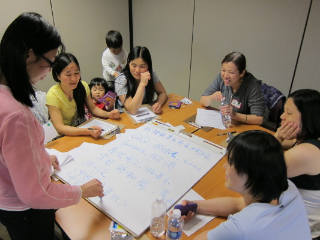

```{r setup, include=FALSE}
knitr::opts_chunk$set(echo = FALSE)
```

```{r bibliotecas, echo=FALSE, message=FALSE, results='hide', render=FALSE, warning=FALSE}
  # Carregando bibliotecas que serão utilizadas
  library(dplyr)
  library(data.table) # Biblioteca utilizada para leitura de arquivos
  library(png)
  library(grid)
  library(ggplot2)
```

```{r configGGPLOT, echo=FALSE}
  # Setando tema default do ggplot como sendo o theme_light
  theme_set(theme_light())
  
  # Alterando algumas características:
  theme_update(
    plot.title = element_text(lineheight=1.6,
                              face="bold",
                              size="16"),
    axis.title = element_text(color="#333333",
                              size="12"),
    axis.text = element_text(color="#333333",
                             size="10"),
    axis.text.y = element_text(margin=margin(l=6)),
  
    legend.title = element_text(color="#333333",
                                size="10"),
    legend.text = element_text(color="#333333",
                               size="8"),
    # Para facets
    strip.text = element_text(color="#333333",
                              size="8",
                              face="bold"),
    strip.background = element_rect(fill="#999999", colour = "#999999")
  )
  
  dados <- readRDS('dados_da_aula.Rdata')
```

# Quem sou

## 
 - Hacker
 - Engenheiro
 - [Transparência Hacker](http://groups.google.com/group/thackday)
 - [PoliGNU](http://polignu.org)
 - [Estadão Dados](http://blog.estadaodados.com)
 - [Ministério da Justiça](http://pensandoodireito.mj.gov.br)
 - [ASK](http://ask.ar.com)

# Proposta da Aula

##  {.flexbox .vcenter .thanks}
Apresentar um *case* de tratamento e análise de dados públicos, indicando
dificuldades comuns, e algumas possibilidades de como realizar tais análises,
objetivando encontrar indicações de ocorrências que mereçam investigação mais
detalhada.

# Ambientes e Tecnologias
## Ambiente
 - Sistema Operacional: GNU/Linux Debian Jessie (8.3)

## GNU/Linux ?  {.flexbox .vcenter .thanks}


## Tecnologias e Ferramentas
 - LibreOffice Calc (5.0.4.2) 
 - R (3.2.3) 
 - Rstudio (0.99.878) 
 - RMarkdown

# Dados utilizados

## Possibilidades e Escolha
 - 555 bases catalogadas no Catálogo Municipal de Bases de Dados (CMBD)
 - 96 conjuntos de dados no Portal de Dados Abertos do Município de São Paulo
 
## Dados escolhidos
 - Escolha pelas bases de salários das autarquias públicas municipais
 
## Autarquias
**autarquia** | **autarquia** | **autarquia**
-------- | --------- | ----------
**ahmsp** | **amlurb** | **cet**
**cohab** | **fundatec** | **hspm**
**iprem** | **prodam** | **sfmsp**
**spcine** | **spda** | **spnegocios**
**spobras** | **spsec** | **sptrans**
**spturis** | **spurbanismo** | **tmsp**

# Pré-processamento
```{r, echo=FALSE}
#Sempre antes de iniciarmos qualquer análise de dados precisamos passar por uma
#etapa de pré-processamento da(s) base(s) de dados que iremos trabalhar. Isto serve
#para garantirmos uma certa uniformidade nas informações, em especial quando temos
#mais de uma base. E serve também para conhecermos a estrutura da(s) base(s) que
#iremos analisar.
```

## Codificação e Quebra de Linha
```{r, echo=FALSE}
#A primeira questão que precisamos avaliar é a codificação dos arquivos/dados.
```
 - Principais Codificações:
    - UTF-8
    - ISO-8859-1
 - Ferramentas para converter:
    - LibreOffice Calc (Planilha Eletrônica)
    - *iconv* (software de linha de comando)

 - [Quebra de Linha](https://en.wikipedia.org/wiki/Newline)

## Estrutura dos Dados
 - Quais são os campos (variáveis) de cada base de dados
    - Qual o tipo de cada campo?
    - Quais são as opções que cada campo deve(ria) permitir?

***

### Principais tipos de variáveis (no R)
 - Decimais (*Numeric*)
 - Inteiros (*Integer*)
 - Texto (*Character*)
 - Fatores (*Factors*)
 - *Data Frames*
 - Lógicos (*Logical*)

 - https://www.datacamp.com/courses/free-introduction-to-r
 - http://tryr.codeschool.com

***

### Conteúdo das variáveis Categóricas (Fatores) - Cargos {.small}
 - O.M.AUT/LUBRIF.QPD7E
 - O.OBRAS/EXPED.QPD7E
 - OF.OBRAS/MARC.QPD6E
 - TEC TECNOL INF COMUN
 - TÉCNICO DE DESENVOLV ADMINISTRATIVO
 - TECNICO DE DESENVOLVIMENTO INFANTIL
 - TÉCNICO DE INFORMÁTICA
 - TÉCNICO DE PROC. ADM. PL - REC. HUMANOS
 - TÉCNICO DE PROCESSOS ADMINISTRATIVOS JR
 - TECNICO EDIFICACOES
 - TECNICO EM EDIFICAÇOES I

# Análises preliminares (estatísticas descritivas)

## Dados Quantitativos
 - Distribuição
 - Média
 - Mediana
 - Desvio Padrão
 - BoxPlot

```{r, echo=FALSE}
dados.filtrados <- dados %>%
  filter(CARGO.RESUMIDO %in% 
            #sample(dados$CARGO.RESUMIDO, 20)
            c('GERENTE',
              'ASSISTENTE',
              'GESTOR',
              'CONSELHEIRO/CONSULTOR',
              'ESTAGIÁRIO',
              'ANALISTA')
  )
```

***

### Distribuição, Média e Mediana
```{r, fig.width = 10, fig.height = 4.8, echo=FALSE}
ggplot(dados.filtrados, aes(VENCIMENTOS, fill=CARGO.RESUMIDO)) +
    facet_wrap(~CARGO.RESUMIDO) +
    geom_density( alpha=0.5 ) +
    geom_vline(aes(xintercept = median(VENCIMENTOS), linetype="mediana")) + 
    geom_vline(aes(xintercept = mean(VENCIMENTOS), linetype="média")) + 
    scale_y_continuous('Frequência Relativa', labels=scales::percent) + 
    scale_x_continuous(labels=function(x){return(x/1000)}) +
    guides(fill=FALSE,
           linetype=guide_legend(title='')) + 
    theme(panel.background = element_rect(fill = "transparent",colour = NA),
          plot.background = element_rect(fill = "transparent",colour = NA),
          panel.grid = element_line(colour='#cccccc'))
```

***

### Distribuição, Média e Mediana
```{r, fig.width = 10, fig.height = 4.8, echo=FALSE}
ggplot(dados.filtrados, aes(VENCIMENTOS, fill=CARGO.RESUMIDO)) +
    facet_wrap(~CARGO.RESUMIDO, scales = 'free') +
    geom_density( alpha=0.5 ) +
    geom_vline(aes(xintercept = median(VENCIMENTOS), linetype="mediana")) + 
    geom_vline(aes(xintercept = mean(VENCIMENTOS), linetype="média")) + 
    scale_y_continuous('Frequência Relativa', labels=scales::percent) + 
    scale_x_continuous(labels=function(x){return(x/1000)}) +
    guides(fill=FALSE,
           linetype=guide_legend(title='')) + 
    theme(panel.background = element_rect(fill = "transparent",colour = NA),
          plot.background = element_rect(fill = "transparent",colour = NA),
          panel.grid = element_line(colour='#cccccc'))
```

***

### BoxPlot
```{r, fig.width = 10, fig.height = 4.8, echo=FALSE}
ggplot(dados.filtrados, aes(x = CARGO.RESUMIDO, y = VENCIMENTOS, colour = CARGO.RESUMIDO ) ) +
  geom_boxplot(alpha=0.5, show.legend = F) + xlab('Cargo') + coord_flip()
```

## Dados Qualitativos
 - Contagem
    - Frequência Absoluta
    - Frequência Relativa

***

### Histograma (Frequência Absoluta)
```{r, fig.width = 10, fig.height = 4.8, echo=FALSE}
ggplot(dados.filtrados, aes(CARGO.RESUMIDO, fill = CARGO.RESUMIDO)) +
  geom_bar(show.legend = F, alpha = 0.5) + 
  scale_y_continuous('Frequência Absoluta')
```

***

### Histograma (Frequência Relativa)
```{r, fig.width = 10, fig.height = 4.8, echo=FALSE, warning=FALSE, message=FALSE}
ggplot(dados.filtrados, aes(x=CARGO.RESUMIDO,
                            fill = CARGO.RESUMIDO)) +
  geom_bar(aes(y = (..count..)/tapply(..count..,..PANEL..,sum)[..PANEL..]),
           show.legend = F, alpha = 0.5) + 
  scale_y_continuous('Frequência Relativa', labels = scales::percent,
                     breaks=seq(0,0.6,0.1))
```

## Outros Recursos
 - Processamento de Linguagem Natural (PLN)
 - Análise Multivariada (conjunto de técnicas)
 - Geoprocessamento
 - *Machine Learning*
 - Técnicas de Coleta / Entrevista / Grupo Focal / Estudo Etnográfico, Observação, etc
 
## {.flexbox .vcenter}

### Grupo Focal


## Ferramentas possíveis de serem utilizadas
 - R
 - Python
    - Pandas
    - SciPy
    - NumPy
 - Ipython Notebook (Jupyter) e RPubs
 - Github
 - LibreOffice Calc e outras Planilhas Eletrônicas
 - QGis
 - CartoDB
 
## Retomando Pontos importantes
 - Utilização de Padrões e Formatos Livres/Abertos
 - Dicionário de Dados
 - Ontologias
 - Georreferenciamento
 - Conhecimento das possíveis ferramentas a serem utilizadas
 - Equipe multidisciplinar
 - Conhecimento humano

# Referências e Cursos

## Referências
 - Bons exemplos de uso: http://www.r-bloggers.com/
 - Resources to help you learn and use R: http://statistics.ats.ucla.edu/stat/r/
 - [Uma visão geral sobre ontologias: pesquisa sobre definições, tipos, aplicações, métodos de avaliação e de construção](http://www.scielo.br/pdf/ci/v32n3/19019)
 - [Repositório de Vocabulários e Ontologias do Governo Eletrônico](http://vocab.e.gov.br/)
 - [DatabaseCast - Cientista de Dados (PodCast)](http://imasters.com.br/banco-de-dados/databasecast-cientista-de-dados/?trace=1519021197&source=single)
 - [Glossário do Portal Brasileiro de Dados Abertos](http://kit.dados.gov.br/Gloss%C3%A1rio/)
 - [Open source data mining tools for audit purposes](https://www.researchgate.net/profile/Isabel_Pedrosa/publication/238591771_Open_source_data_mining_tools_for_audit_purposes/links/55faa21d08aeafc8ac3e2c5e.pdf?inViewer=0&pdfJsDownload=0&origin=publication_detail)
 
## Cursos {.smaller}
 - Big Data em Saúde no Brasil: https://www.coursera.org/course/bigdatabrasil
 - TryR: http://tryr.codeschool.com/
 - The Data Scientist’s Toolbox: https://www.coursera.org/learn/data-scientists-tools
 -  RProgramming: https://www.coursera.org/learn/r-programming
 - Exploratory Data Analysis: https://www.coursera.org/learn/exploratory-data-analysis
 - Statistics One: https://www.coursera.org/course/stats1
 - https://lagunita.stanford.edu/courses/HumanitiesSciences/StatLearning/Winter2016/about
 - http://online.stanford.edu/course/statistical-learning-winter-2014
 - \url{http://ocw.mit.edu/resources/res-9-0002-statistics-and-visualization-for-data-analysis-and-inference-january-iap-2009/}
 - https://www.edx.org/course
 - An introduction to ggplot2 - http://seananderson.ca/ggplot2-FISH554/
 - R Online Learning: https://www.rstudio.com/resources/training/online-learning/

# Agradecimento

## {.flexbox .vcenter .thanks}
Controladoria Geral do Município de São Paulo

## {.flexbox .vcenter}
Este material e os arquivos e códigos utilizados para gerá-lo estão licenciados
sob as licenças Creative Commons CC-By-SA (https://creativecommons.org/licenses/by-sa/3.0/br/)
e GNU GPL V3 or later, respectivamente.

Contatos:

@diraol

diraol@diraol.eng.br


<div class="smaller">
Todos os materiais desta aula podem ser encontrados em: https://github.com/diraol/AulaAnaliseDeDados
</div>
